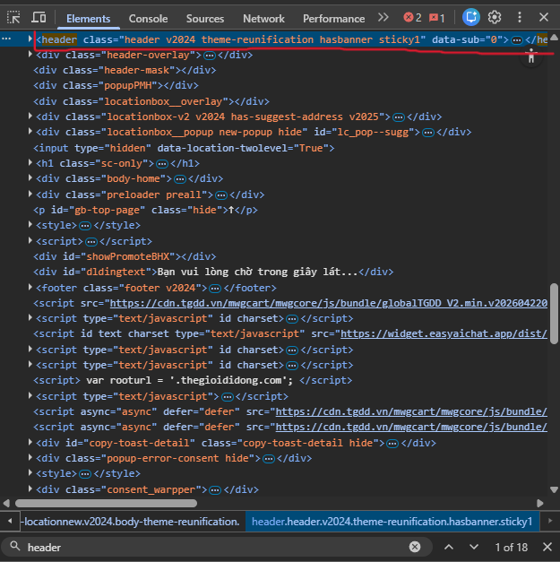
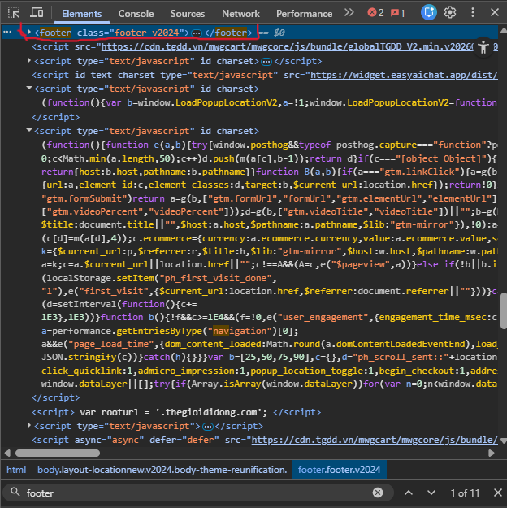
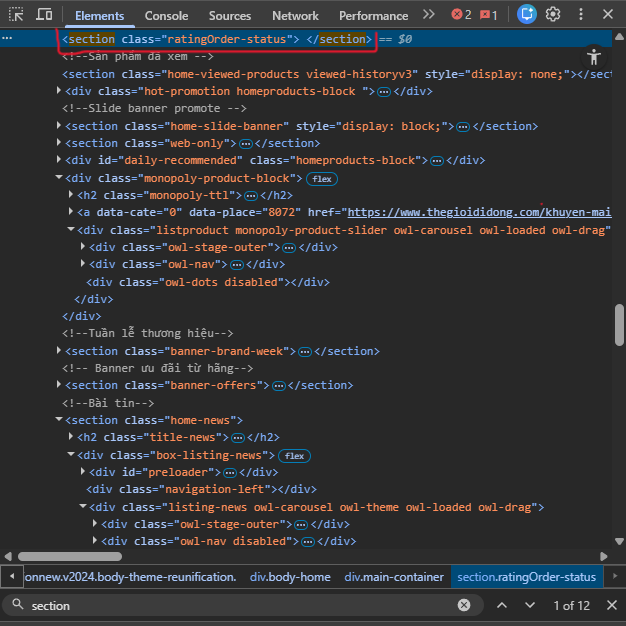
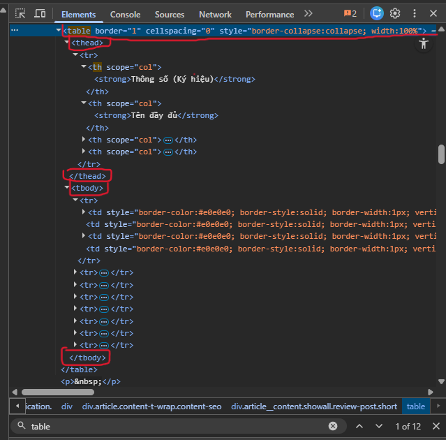
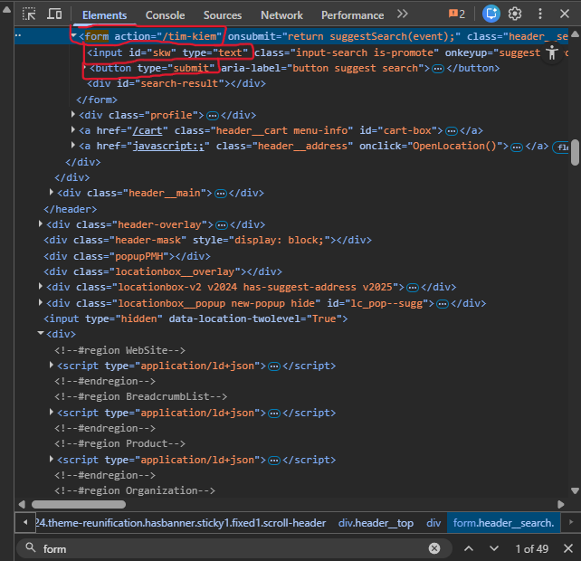

# Câu A1 — HTTP & Browser

1. Khi gõ https://shopee.vn vào trình duyệt và ấn Enter. Các bước xảy ra sẽ là:

Bước 1: Trình duyệt thực hiện "DNS lookup" để tìm IP của website (shopee.vn)

Bước 2: Sau khi có được IP, trình duyệt sẽ gửi "request" (yêu cầu) từ máy người dùng qua Internet và đến "server" (máy chủ)

Bước 3: Server sau khi nhận được request thì sẽ bắt đầu tìm tài nguyên để trả về (VD: HTML của trang web)

Bước 4: Server sẽ gửi lại "HTTP response" cho trình duyệt

Bước 5: Sau khi nhận dữ liệu, bắt đầu "parse HTML" để tạo cấu trúc trang

Bước 6: Trình duyệt sẽ tiếp tục tải thêm các tài nguyên khác như CSS và JavaScript (JS)

Bước 7: Trình duyệt thực hiện "parse CSS" sau đó sẽ "Execute" (thực thi) JS nếu có

Bước 8: Cuối cùng, trình duyệt thực hiện "Layout → Paint → Composite" để "render" giao diện ra màn hình 

**Nguồn tham chiếu: Chương 1 của tuần 1 tại phần 0, phần 2 và phần 3**

2. Trong DevTools của Chrome, tab Network cho ta thấy thông tin:

- Các request được gửi đi
- Các response mà server trả về
- Tên file hoặc tài nguyên được tải
- Các "status code" (Mã trạng thái) như là '200', '404', '500', '301'.
- Loại tài nguyên như HTML, CSS, JS và ảnh
- Thời gian tải của từng request và tổng thời gian tải trang


# Câu A2 - Semantic HTML

Theo em, trang web bị đánh giá SEO thấp là do đang dùng quá nhiều thẻ `<div>` cho những phần không cần nhất thiết phải dùng hoặc đã có ý nghĩa rõ ràng như: đầu trang (header), menu (nav), ...

Tóm gọn lại có ít nhất là 4 lỗi như sau:

- Dùng thẻ `<div class="header">` cho đầu trang thay vì thẻ `<header>`

- Dùng thẻ `<div class = "menu">` thay vì thẻ `<nav>`

- Dùng thẻ `<div class="main">` thay vì thẻ `<main>`

- Dùng thẻ `<div class="footer">` thay vì thẻ `<footer>`

Để sửa lại thì sẽ thành:

```html
<header>
    <div class="logo">ShopTLU</div>
    <nav>
        <div><a href="/">Trang chủ</a></div>
        <div><a href="/products">Sản phẩm</a></div>
    </nav>
</header>

<main>
    <div class="product">
        <div class="title">iPhone 16 Pro</div>
        <div class="price">25.990.000đ</div>
        <div class="image">
            
        </div>
    </div>
</main>

<footer>© 2026 ShopTLU</footer>
```

**Nguồn tham chiếu: Chương 4 của tuần 1, phần 1, phần 2, phần 3 và phần 7, phần 9**

# Câu A3 — Block vs Inline

```text
Hộp 1
Text A Text B
Hộp 2
Text C Text D
Hộp 3
```

**Nguồn tham chiếu: Phần 3, phần 9**

# Câu A4 — Table

1. Phân biệt `<thead>`, `<tbody>`, `<tfoot>`

- `<thead>` là phần đầu bảng, chứa tiêu đề các cột
- `<tbody>` là phần thân bảng, chứa dữ liệu chính
- `<tfoot>` là phần cuối bảng, thường dùng để tổng kết

Ba phần này giúp bảng rõ ràng hơn, dễ đọc hơn và dễ style hơn

2. Theo em, không nên dùng table để tạo layout vì:

- `<table>` chỉ phù hợp cho dữ liệu có hàng và cột, không phải để chia bố cục trang
- Screen reader có thể hiểu sai vì nghĩ đó là bảng dữ liệu thật
- Layout bằng table khó responsive trên điện thoại
- Code sẽ khó sửa và khó bảo trì hơn
- Làm layout nên dùng CSS Flexbox hoặc CSS Grid sẽ hợp lý hơn

**Nguồn tham chiếu: Chương 5 Phần 3, 5, 7, 9**

# Câu B3 - Debug HTML
```text
Lỗi 1: Dòng 1 — Thiếu khai báo html trong DOCTYPE — Sửa: Thay <!DOCTYPE> bằng <!DOCTYPE html>.

Lỗi 2: Dòng 2 — Thẻ <html> thiếu thuộc tính ngôn ngữ — Sửa: Đổi <html> thành <html lang="vi">.

Lỗi 3: Dòng 4 — Thiếu thẻ đóng cho <title> — Sửa: Thêm </title> sau nội dung tiêu đề.

Lỗi 4: Dòng 5 — Sai định dạng thuộc tính charset — Sửa: Thay utf8 bằng UTF-8.

Lỗi 5: Phần <head> thiếu thẻ viewport — Sửa: Thêm <meta name="viewport" content="width=device-width, initial-scale=1.0">.

Lỗi 6: Dòng 8 — Thẻ <h1> không được đóng đúng cách — Sửa: Đổi <h1>Welcome to ShopTLU<h1> thành <h1>Welcome to ShopTLU</h1>.

Lỗi 7: Dòng 12 — Thẻ <a> đầu tiên thiếu thẻ đóng — Sửa: Đổi <a href="home">Trang chủ<a> thành <a href="home">Trang chủ</a>.

Lỗi 8: Dòng 17 — Thuộc tính src của ảnh thiếu dấu ngoặc kép — Sửa: Đổi thành .

Lỗi 9: Dòng 17 — Thẻ  thiếu thuộc tính alt — Sửa: Thêm alt="iPhone 16 Pro".

Lỗi 10: Dòng 19 — Sai thứ tự đóng thẻ lồng nhau — Sửa: Đổi <p>Giá: <b>25.990.000đ</p></b> thành <p>Giá: <strong>25.990.000đ</strong></p>.

Lỗi 11: Dòng 25–26 — Hàng tiêu đề bảng dùng <td> thay vì <th> — Sửa: Đổi hai ô tiêu đề thành <th>Tên</th> và <th>Giá</th>.

Lỗi 12: Phần bảng thiếu cấu trúc semantic — Sửa: Bổ sung <thead> và <tbody> cho bảng.

Lỗi 13: Dòng 34 — Dùng thẻ <main> lần thứ hai — Sửa: Đổi phần sidebar thành <aside>.

Lỗi 14: Dòng 38 — Thẻ <p> trong footer thiếu thẻ đóng — Sửa: Thêm </p>.

Lỗi 15: Cuối file — Thiếu thẻ đóng </html> — Sửa: Thêm </html>.
```

# Câu B4 - Phân tích trang web thật

Em chọn trang: `thegioididong.com`

1. Phân tích semantic HTML5

a) Thẻ `<header>`



Thẻ `<header>` được dùng ở phần đầu trang web. Theo em, đây là khu vực đầu trang nên dùng thẻ semantic này là phù hợp

b) Thẻ `<footer>`



Thẻ `<footer>` được dùng ở phần cuối trang web. Phần này thường chứa thông tin cuối trang nên việc dùng `<footer>` là đúng semantic

c) Thẻ `<section>`



Thẻ `<section>` được dùng để chia nội dung thành từng phần trong thân trang. Theo em, đây là cách dùng hợp lý để tổ chức nội dung

- 3 thẻ semantic HTML5 mà trang đó sử dụng
1. Thẻ `<header>`  nằm ở phần đầu trang
2. Thẻ `<footer>`  nằm ở phần cuối trang
3. Thẻ `<section>`  nằm ở khu vực nội dung trong thân trang

2. Phân tích table



Table này hiển thị nội dung về **thông số (ký hiệu) và tên đầy đủ** trong phần nội dung của trang

- Có dùng `<thead>` 
- Có dùng `<tbody>`

3. Phân tích form



Form này là form tìm kiếm trên trang

- Form đó có `action`: `/tim-kiem`
- Các input types được dùng: `text`, `submit`

**Nguồn tham chiếu: Chương 4 Phần 1, 2, 3 và Chương 5 Phần 3**

**Nguồn quan sát thực tế: Chrome DevTools (F12) trên `thegioididong.com`**

# Câu C1 - Thiết kế cấu trúc

```html
<header> <!-- header vì đây là phần đầu trang -->
    <nav> <!-- nav vì đây là menu điều hướng -->
        <ul> <!-- ul vì menu là danh sách link -->
            <li><a href="/">Trang chủ</a></li> <!-- a để chuyển trang -->
            <li><a href="/dien-thoai">Điện thoại</a></li>
            <li><a href="/lien-he">Liên hệ</a></li>
        </ul>
    </nav>
</header>

<main> <!-- main vì đây là nội dung chính của trang -->
    <nav aria-label="breadcrumb"> <!-- nav vì breadcrumb cũng là điều hướng -->
        <ol> <!-- ol vì breadcrumb có thứ tự -->
            <li><a href="/">Trang chủ</a></li>
            <li><a href="/dien-thoai">Điện thoại</a></li>
            <li><a href="/iphone-16">iPhone 16</a></li>
        </ol>
    </nav>

    <section> <!-- section này là khu vực ảnh sản phẩm -->
        <h1>Tên sản phẩm</h1> <!-- h1 vì đây là tiêu đề chính của trang -->
        
        <figure> <!-- figure để chứa ảnh -->
             <!-- img để hiện ảnh -->
            <figcaption>Ảnh 1</figcaption> <!-- figcaption để ghi chú ảnh -->
        </figure>

        <figure>
            
            <figcaption>Ảnh 2</figcaption>
        </figure>

        <figure>
            
            <figcaption>Ảnh 3</figcaption>
        </figure>

        <figure>
            
            <figcaption>Ảnh 4</figcaption>
        </figure>

        <figure>
            
            <figcaption>Ảnh 5</figcaption>
        </figure>
    </section>

    <section> <!-- section này là phần thông tin sản phẩm -->
        <h2>Thông tin sản phẩm</h2> <!-- h2 vì đây là tiêu đề phụ -->
        <p>Tên sản phẩm</p> <!-- p để ghi thông tin ngắn -->
        <p>Giá sản phẩm</p>
        <p>Đánh giá sao</p>
        <p>Mô tả sản phẩm</p>
    </section>

    <section> <!-- section này là bảng thông số kỹ thuật -->
        <h2>Thông số kỹ thuật</h2>
        <table> <!-- table vì đây là dữ liệu dạng bảng -->
            <thead> <!-- thead là phần tiêu đề bảng -->
                <tr> <!-- tr là một hàng -->
                    <th>Thông số</th> <!-- th là ô tiêu đề -->
                    <th>Chi tiết</th>
                </tr>
            </thead>
            <tbody> <!-- tbody là phần dữ liệu chính -->
                <tr>
                    <td>Màn hình</td> <!-- td là ô dữ liệu -->
                    <td>...</td>
                </tr>
                <tr>
                    <td>Chip</td>
                    <td>...</td>
                </tr>
                <tr>
                    <td>Bộ nhớ</td>
                    <td>...</td>
                </tr>
            </tbody>
        </table>
    </section>

    <section> <!-- section này là phần đánh giá và bình luận -->
        <h2>Đánh giá / bình luận</h2>

        <article> <!-- article vì mỗi bình luận có thể xem là một nội dung riêng -->
            <h3>Bình luận 1</h3>
            <p>Nội dung bình luận</p>
        </article>

        <article>
            <h3>Bình luận 2</h3>
            <p>Nội dung bình luận</p>
        </article>
    </section>

    <aside> <!-- aside vì đây là phần sản phẩm tương tự ở bên cạnh -->
        <h2>Sản phẩm tương tự</h2>
        <ul> <!-- ul vì đây là danh sách sản phẩm -->
            <li><a href="/sp1">Sản phẩm 1</a></li>
            <li><a href="/sp2">Sản phẩm 2</a></li>
            <li><a href="/sp3">Sản phẩm 3</a></li>
        </ul>
    </aside>
</main>

<footer> <!-- footer vì đây là phần cuối trang -->
    <p>Thông tin cuối trang</p>
</footer>
```
Những chỗ trống và ảnh khi có thì có thể thực hiện, đối với ảnh thì nếu muốn có ảnh để nhét tạm vào mà chưa có ảnh để minh họa thì dùng placeholder

# Câu C2 — So sánh & Tranh luận

Theo em, ý kiến “chỉ cần dùng `<div>` cho mọi thứ rồi thêm class là đủ” là chưa đúng. Cách đó có thể làm trang web vẫn hiển thị được, nhưng về mặt kỹ thuật thì semantic HTML vẫn rất quan trọng

Lý do thứ nhất là **SEO**. Google không chỉ đọc chữ trên trang mà còn đọc cấu trúc HTML để hiểu đâu là phần đầu trang, đâu là menu, đâu là nội dung chính, đâu là bài viết hoặc sản phẩm. Nếu tất cả đều là `<div>` thì Google sẽ khó hiểu ý nghĩa của từng phần hơn. Ngược lại, khi dùng các thẻ như `<header>`, `<nav>`, `<main>`, `<article>`, `<section>`, `<footer>`, cấu trúc trang sẽ rõ ràng hơn và có lợi hơn cho SEO

Lý do thứ hai là **Accessibility**. Các công cụ hỗ trợ như screen reader dùng semantic HTML để giúp người dùng khiếm thị điều hướng nhanh hơn. Ví dụ, nếu một khu vực là menu thì dùng `<nav>` sẽ dễ hiểu hơn nhiều so với `<div class="menu">`. Tương tự, nếu một sản phẩm hoặc bài viết dùng `<article>` thì công cụ hỗ trợ cũng hiểu đây là một nội dung độc lập

Ví dụ cụ thể là một trang bán hàng. Nếu mỗi sản phẩm được bọc trong `<article>`, tên sản phẩm dùng heading, ảnh đặt trong `<figure>`, thì cấu trúc sẽ rõ ràng hơn cho cả Google lẫn người dùng

Tuy nhiên, không phải lúc nào cũng phải tránh `<div>`. Theo em, `<div>` vẫn phù hợp khi chỉ cần một khối để nhóm nội dung phục vụ CSS hoặc layout, ví dụ như một wrapper để căn giữa nội dung hoặc chia bố cục đơn giản

**Nguồn tham chiếu: Chương 4 Phần 1, 7, 9**
